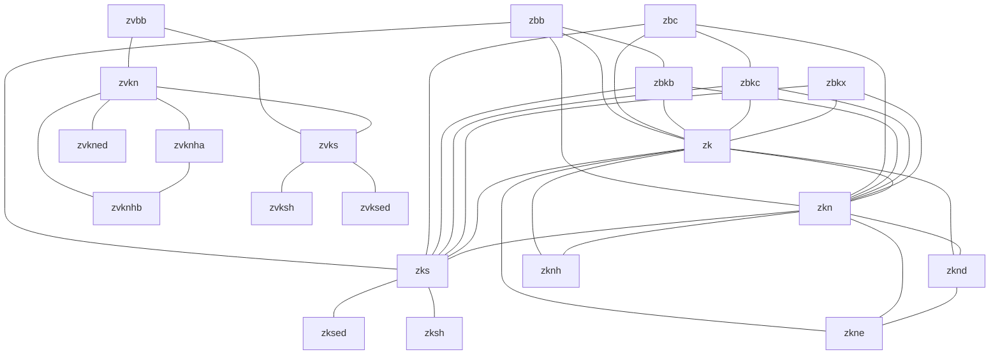

# RISC-V Instruction Set Explorer

Parses RISC-V instruction definitions from `instr_dict.json`, cross-references them against the official ISA manual AsciiDoc sources, and generates an extension relationship graph. Covers all three challenge tiers: instruction set parsing, ISA manual cross-reference, and a bonus relationship graph with unit tests.

---

## Prerequisites

- [Node.js](https://nodejs.org/) v14 or higher
- Git

---

## Setup

```bash
# 1. Clone this repository
git clone 
cd risc-v-instruction-set-explorer

# 2. Fetch the instruction dictionary
git clone https://github.com/rpsene/riscv-extensions-landscape
cp riscv-extensions-landscape/instr_dict.json .

# 3. Fetch the ISA manual (required for Tier 2)
git clone https://github.com/riscv/riscv-isa-manual
```

Expected directory layout after setup:

```
risc-v-instruction-set-explorer/
├── explorer.js
├── explorer.test.js
├── instr_dict.json                  ← copied from riscv-extensions-landscape
└── riscv-isa-manual/
    └── src/                         ← scanned by Tier 2
```

---

## Usage

Run the full report (Tier 1 + Tier 2 + Tier 3):

```bash
node explorer.js
```

Run the unit tests:

```bash
node explorer.test.js
```

---

## Sample Output

```
--- Tier 1: Instruction Set Parsing Summary ---
Extension Tag   | Count           | Example
--------------------------------------------------
rv_a            | 11           instructions | e.g. AMOADD_W
rv_c            | 23           instructions | e.g. C_ADD
rv_c_d          | 4            instructions | e.g. C_FLD
rv_d            | 26           instructions | e.g. FADD_D
rv_d_zfa        | 8            instructions | e.g. FCVTMOD_W_D
rv_d_zfhmin     | 2            instructions | e.g. FCVT_D_H
rv_f            | 26           instructions | e.g. FADD_S
rv_f_zfa        | 7            instructions | e.g. FLEQ_S
rv_h            | 13           instructions | e.g. HFENCE_GVMA
rv_i            | 37           instructions | e.g. ADD
rv_m            | 8            instructions | e.g. DIV
rv_q            | 30           instructions | e.g. FADD_Q
rv_q_zfa        | 7            instructions | e.g. FLEQ_Q
rv_q_zfhmin     | 2            instructions | e.g. FCVT_H_Q
rv_s            | 2            instructions | e.g. SFENCE_VMA
rv_sdext        | 1            instructions | e.g. DRET
rv_smrnmi       | 1            instructions | e.g. MNRET
rv_ssctr        | 1            instructions | e.g. SCTRCLR
rv_svinval      | 3            instructions | e.g. SFENCE_INVAL_IR
rv_svinval_h    | 2            instructions | e.g. HINVAL_GVMA
rv_system       | 2            instructions | e.g. MRET
rv_u            | 1            instructions | e.g. URET
rv_v            | 627          instructions | e.g. VAADD_VV
rv_zabha        | 18           instructions | e.g. AMOADD_B
rv_zabha_zacas  | 2            instructions | e.g. AMOCAS_B
rv_zacas        | 2            instructions | e.g. AMOCAS_D
rv_zalasr       | 8            instructions | e.g. LB_AQ
rv_zawrs        | 2            instructions | e.g. WRS_NTO
rv_zba          | 3            instructions | e.g. SH1ADD
rv_zbb          | 17           instructions | e.g. ANDN
rv_zbc          | 3            instructions | e.g. CLMUL
rv_zbkb         | 7            instructions | e.g. ANDN
rv_zbkc         | 2            instructions | e.g. CLMUL
rv_zbkx         | 2            instructions | e.g. XPERM4
rv_zbp          | 1            instructions | e.g. XPERM16
rv_zbs          | 4            instructions | e.g. BCLR
rv_zcb          | 11           instructions | e.g. C_LBU
rv_zcmop        | 1            instructions | e.g. C_MOP_N
rv_zcmp         | 6            instructions | e.g. CM_MVA01S
rv_zcmt         | 1            instructions | e.g. CM_JALT
rv_zfbfmin      | 2            instructions | e.g. FCVT_BF16_S
rv_zfh          | 22           instructions | e.g. FADD_H
rv_zfh_zfa      | 7            instructions | e.g. FLEQ_H
rv_zfhmin       | 6            instructions | e.g. FCVT_H_S
rv_zibi         | 2            instructions | e.g. BEQI
rv_zicbo        | 4            instructions | e.g. CBO_CLEAN
rv_zicfiss      | 2            instructions | e.g. SSAMOSWAP_D
rv_zicond       | 2            instructions | e.g. CZERO_EQZ
rv_zicsr        | 6            instructions | e.g. CSRRC
rv_zifencei     | 1            instructions | e.g. FENCE_I
rv_zimop        | 2            instructions | e.g. MOP_R_N
rv_zk           | 15           instructions | e.g. ANDN
rv_zkn          | 15           instructions | e.g. ANDN
rv_zknh         | 4            instructions | e.g. SHA256SIG0
rv_zkr          | 1            instructions | e.g. CSRRAND
rv_zks          | 15           instructions | e.g. ANDN
rv_zksed        | 2            instructions | e.g. SM4ED
rv_zksh         | 2            instructions | e.g. SM3P0
rv_zvabd        | 5            instructions | e.g. VABD_VV
rv_zvbb         | 16           instructions | e.g. VANDN_VV
rv_zvbc         | 4            instructions | e.g. VCLMUL_VV
rv_zvfbdot32f   | 1            instructions | e.g. VFBDOT_VV
rv_zvfbfmin     | 2            instructions | e.g. VFNCVTBF16_F_F_W
rv_zvfbfwma     | 2            instructions | e.g. VFWMACCBF16_VF
rv_zvfofp4min   | 1            instructions | e.g. VFEXT_VF2
rv_zvfofp8min   | 3            instructions | e.g. VFNCVT_F_F_Q
rv_zvfqbdot8f   | 2            instructions | e.g. VFQBDOT_ALT_VV
rv_zvfqldot8f   | 2            instructions | e.g. VFQLDOT_ALT_VV
rv_zvfwbdot16bf | 1            instructions | e.g. VFWBDOT_VV
rv_zvfwldot16bf | 1            instructions | e.g. VFWLDOT_VV
rv_zvkg         | 2            instructions | e.g. VGHSH_VV
rv_zvkn         | 23           instructions | e.g. VAESDF_VS
rv_zvkned       | 11           instructions | e.g. VAESDF_VS
rv_zvknha       | 3            instructions | e.g. VSHA2CH_VV
rv_zvknhb       | 3            instructions | e.g. VSHA2CH_VV
rv_zvks         | 14           instructions | e.g. VANDN_VV
rv_zvksed       | 3            instructions | e.g. VSM4K_VI
rv_zvksh        | 2            instructions | e.g. VSM3C_VI
rv_zvqbdot8i    | 2            instructions | e.g. VQBDOTS_VV
rv_zvqdotq      | 7            instructions | e.g. VQDOT_VV
rv_zvqldot8i    | 2            instructions | e.g. VQLDOTS_VV
rv_zvzip        | 5            instructions | e.g. VPAIRE_VV
rv32_c          | 1            instructions | e.g. C_JAL
rv32_c_f        | 4            instructions | e.g. C_FLW
rv32_d_zfa      | 2            instructions | e.g. FMVH_X_D
rv32_zk         | 10           instructions | e.g. AES32DSI
rv32_zkn        | 10           instructions | e.g. AES32DSI
rv32_zknd       | 2            instructions | e.g. AES32DSI
rv32_zkne       | 2            instructions | e.g. AES32ESI
rv32_zknh       | 6            instructions | e.g. SHA512SIG0H
rv64_a          | 11           instructions | e.g. AMOADD_D
rv64_c          | 10           instructions | e.g. C_ADDIW
rv64_d          | 6            instructions | e.g. FCVT_D_L
rv64_f          | 4            instructions | e.g. FCVT_L_S
rv64_h          | 3            instructions | e.g. HLV_D
rv64_i          | 15           instructions | e.g. ADDIW
rv64_m          | 5            instructions | e.g. DIVUW
rv64_q          | 4            instructions | e.g. FCVT_L_Q
rv64_q_zfa      | 2            instructions | e.g. FMVH_X_Q
rv64_zacas      | 1            instructions | e.g. AMOCAS_Q
rv64_zba        | 5            instructions | e.g. ADD_UW
rv64_zbb        | 9            instructions | e.g. CLZW
rv64_zbkb       | 5            instructions | e.g. PACKW
rv64_zbp        | 5            instructions | e.g. GORCI
rv64_zbs        | 4            instructions | e.g. BCLRI
rv64_zcb        | 1            instructions | e.g. C_ZEXT_W
rv64_zfh        | 4            instructions | e.g. FCVT_H_L
rv64_zk         | 16           instructions | e.g. AES64DS
rv64_zkn        | 16           instructions | e.g. AES64DS
rv64_zknd       | 5            instructions | e.g. AES64DS
rv64_zkne       | 4            instructions | e.g. AES64ES
rv64_zknh       | 4            instructions | e.g. SHA512SIG0
rv64_zkr        | 1            instructions | e.g. CSRRAND64
rv64_zks        | 5            instructions | e.g. PACKW

Instructions in multiple extensions:
- AES32DSI: [rv32_zknd, rv32_zk, rv32_zkn]
- AES32DSMI: [rv32_zknd, rv32_zk, rv32_zkn]
- AES32ESI: [rv32_zkne, rv32_zk, rv32_zkn]
- AES32ESMI: [rv32_zkne, rv32_zk, rv32_zkn]
- AES64DS: [rv64_zknd, rv64_zkn, rv64_zk]
- AES64DSM: [rv64_zknd, rv64_zkn, rv64_zk]
- AES64ES: [rv64_zkne, rv64_zkn, rv64_zk]
- AES64ESM: [rv64_zkne, rv64_zkn, rv64_zk]
- AES64IM: [rv64_zknd, rv64_zkn, rv64_zk]
- AES64KS1I: [rv64_zknd, rv64_zkn, rv64_zkne, rv64_zk]
- AES64KS2: [rv64_zknd, rv64_zkn, rv64_zkne, rv64_zk]
- ANDN: [rv_zbb, rv_zkn, rv_zks, rv_zk, rv_zbkb]
- CLMUL: [rv_zbc, rv_zkn, rv_zks, rv_zk, rv_zbkc]
- CLMULH: [rv_zbc, rv_zkn, rv_zks, rv_zk, rv_zbkc]
- ORN: [rv_zbb, rv_zkn, rv_zks, rv_zk, rv_zbkb]
- PACK: [rv_zbkb, rv_zkn, rv_zks, rv_zk]
- PACKH: [rv_zbkb, rv_zkn, rv_zks, rv_zk]
- PACKW: [rv64_zbkb, rv64_zks, rv64_zkn, rv64_zk]
- ROL: [rv_zbb, rv_zkn, rv_zks, rv_zk, rv_zbkb]
- ROLW: [rv64_zbb, rv64_zks, rv64_zkn, rv64_zk, rv64_zbkb]
- ROR: [rv_zbb, rv_zkn, rv_zks, rv_zk, rv_zbkb]
- RORI: [rv64_zbb, rv64_zks, rv64_zkn, rv64_zk, rv64_zbkb]
- RORIW: [rv64_zbb, rv64_zks, rv64_zkn, rv64_zk, rv64_zbkb]
- RORW: [rv64_zbb, rv64_zks, rv64_zkn, rv64_zk, rv64_zbkb]
- SHA256SIG0: [rv_zknh, rv_zkn, rv_zk]
- SHA256SIG1: [rv_zknh, rv_zkn, rv_zk]
- SHA256SUM0: [rv_zknh, rv_zkn, rv_zk]
- SHA256SUM1: [rv_zknh, rv_zkn, rv_zk]
- SHA512SIG0: [rv64_zknh, rv64_zkn, rv64_zk]
- SHA512SIG0H: [rv32_zknh, rv32_zk, rv32_zkn]
- SHA512SIG0L: [rv32_zknh, rv32_zk, rv32_zkn]
- SHA512SIG1: [rv64_zknh, rv64_zkn, rv64_zk]
- SHA512SIG1H: [rv32_zknh, rv32_zk, rv32_zkn]
- SHA512SIG1L: [rv32_zknh, rv32_zk, rv32_zkn]
- SHA512SUM0: [rv64_zknh, rv64_zkn, rv64_zk]
- SHA512SUM0R: [rv32_zknh, rv32_zk, rv32_zkn]
- SHA512SUM1: [rv64_zknh, rv64_zkn, rv64_zk]
- SHA512SUM1R: [rv32_zknh, rv32_zk, rv32_zkn]
- SM3P0: [rv_zksh, rv_zks]
- SM3P1: [rv_zksh, rv_zks]
- SM4ED: [rv_zksed, rv_zks]
- SM4KS: [rv_zksed, rv_zks]
- VAESDF_VS: [rv_zvkned, rv_zvkn]
- VAESDF_VV: [rv_zvkned, rv_zvkn]
- VAESDM_VS: [rv_zvkned, rv_zvkn]
- VAESDM_VV: [rv_zvkned, rv_zvkn]
- VAESEF_VS: [rv_zvkned, rv_zvkn]
- VAESEF_VV: [rv_zvkned, rv_zvkn]
- VAESEM_VS: [rv_zvkned, rv_zvkn]
- VAESEM_VV: [rv_zvkned, rv_zvkn]
- VAESKF1_VI: [rv_zvkned, rv_zvkn]
- VAESKF2_VI: [rv_zvkned, rv_zvkn]
- VAESZ_VS: [rv_zvkned, rv_zvkn]
- VANDN_VV: [rv_zvbb, rv_zvks, rv_zvkn]
- VANDN_VX: [rv_zvbb, rv_zvks, rv_zvkn]
- VBREV8_V: [rv_zvbb, rv_zvks, rv_zvkn]
- VREV8_V: [rv_zvbb, rv_zvks, rv_zvkn]
- VROL_VV: [rv_zvbb, rv_zvks, rv_zvkn]
- VROL_VX: [rv_zvbb, rv_zvks, rv_zvkn]
- VROR_VI: [rv_zvbb, rv_zvks, rv_zvkn]
- VROR_VV: [rv_zvbb, rv_zvks, rv_zvkn]
- VROR_VX: [rv_zvbb, rv_zvks, rv_zvkn]
- VSHA2CH_VV: [rv_zvknha, rv_zvknhb, rv_zvkn]
- VSHA2CL_VV: [rv_zvknha, rv_zvknhb, rv_zvkn]
- VSHA2MS_VV: [rv_zvknha, rv_zvknhb, rv_zvkn]
- VSM3C_VI: [rv_zvksh, rv_zvks]
- VSM3ME_VV: [rv_zvksh, rv_zvks]
- VSM4K_VI: [rv_zvksed, rv_zvks]
- VSM4R_VS: [rv_zvksed, rv_zvks]
- VSM4R_VV: [rv_zvksed, rv_zvks]
- XNOR: [rv_zbb, rv_zkn, rv_zks, rv_zk, rv_zbkb]
- XPERM4: [rv_zbkx, rv_zkn, rv_zks, rv_zk]
- XPERM8: [rv_zbkx, rv_zkn, rv_zks, rv_zk]

--- Tier 2: ISA Manual Cross-Reference ---
Matched: 56
In JSON only: 29
In manual only: 0
Summary: 56 matched, 29 in JSON only, 0 in manual only

Extensions in JSON but NOT found in Manual:
a, c_d, c_f, d_zfa, d_zfhmin, f_zfa, i, q_zfa, q_zfhmin, sdext,
svinval_h, u, zabha_zacas, zbp, zfh_zfa, zibi, zicbo, zvabd,
zvfbdot32f, zvfofp4min, zvfofp8min, zvfqbdot8f, zvfqldot8f,
zvfwbdot16bf, zvfwldot16bf, zvqbdot8i, zvqdotq, zvqldot8i, zvzip

--- Tier 3: Bonus - Extension Relationship Graph (Shared Instructions) ---
Adjacency List (Normalized Extension A -> [Others]):
zbb             -> [zbkb, zk, zkn, zks]
zbc             -> [zbkc, zk, zkn, zks]
zbkb            -> [zbb, zk, zkn, zks]
zbkc            -> [zbc, zk, zkn, zks]
zbkx            -> [zk, zkn, zks]
zk              -> [zbb, zbc, zbkb, zbkc, zbkx, zkn, zknd, zkne, zknh, zks]
zkn             -> [zbb, zbc, zbkb, zbkc, zbkx, zk, zknd, zkne, zknh, zks]
zknd            -> [zk, zkn, zkne]
zkne            -> [zk, zkn, zknd]
zknh            -> [zk, zkn]
zks             -> [zbb, zbc, zbkb, zbkc, zbkx, zk, zkn, zksed, zksh]
zksed           -> [zks]
zksh            -> [zks]
zvbb            -> [zvkn, zvks]
zvkn            -> [zvbb, zvkned, zvknha, zvknhb, zvks]
zvkned          -> [zvkn]
zvknha          -> [zvkn, zvknhb]
zvknhb          -> [zvkn, zvknha]
zvks            -> [zvbb, zvkn, zvksed, zvksh]
zvksed          -> [zvks]
zvksh           -> [zvks]

Mermaid Diagram Source:

---

## Features

### Tier 1 — Instruction set parsing
- Reads and parses `instr_dict.json` with full error handling (malformed JSON, missing fields)
- Groups instructions by extension tag; handles `extension` field as string, array, or missing
- De-duplicates tags per instruction before counting (a tag listed twice is counted once)
- Identifies instructions that belong to more than one logical extension
- Prints a summary table with each extension tag, instruction count, and a deterministic example mnemonic (alphabetically first)

### Tier 2 — ISA manual cross-reference
- Recursively scans all `.adoc` files under `riscv-isa-manual/src/`
- Matches RISC-V extension names using a targeted regex: single uppercase letters (M, F, C…) and Z/S/X-prefixed names (Zba, Zbb, Zicsr…)
- Normalises both sources before comparison (`rv_zba` → `zba`, `Zba` → `zba`) to handle naming differences between the two repos
- Reports: extensions matched in both, extensions in JSON only, extensions in manual only — with full name lists for each category

### Tier 3 — Bonus
- **Unit tests**: four test functions covering `normalize()`, `parseInstructions()`, `scanManual()`, and `generateGraph()` using mock file fixtures
- **Relationship graph**: adjacency list showing which extensions share at least one instruction, plus a Mermaid diagram source for visual rendering

---

## Design Decisions

- **Normalization strategy** — `rv32_zba`, `rv64_zba`, and `rv_zba` are all collapsed to `zba` before cross-referencing and graph generation. This matches the bare names used in the ISA manual. Trade-off: architecture-width distinction (32 vs 64) is lost; this was judged acceptable because the manual itself does not split extensions by width in most contexts.

- **Regex design for Tier 2** — Single uppercase letters (`M`, `F`, `C`, etc.) are matched with strict word boundaries. `Z`-prefixed names use `[Zz][a-z0-9]+` to catch both `Zba` and `zba` spellings found in the manual. `S` and `X` prefixes are kept uppercase-only because lowercase `s`/`x` words (`section`, `store`, `shift`) are too common in English prose and cause false positives.

- **False-positive blocklist** — Common AsciiDoc structural words (`table`, `figure`, `version`, `index`, `note`) are blocked even when they technically match the regex pattern. This is a pragmatic heuristic; the known limitation is that the list is not exhaustive.

- **Graph normalization** — Graph nodes use normalized extension names so that `rv32_zbb` and `rv64_zbb` appear as a single node `zbb`. This produces a cleaner, more readable architecture map at the cost of width-variant detail.

- **`generateGraph()` dual mode** — The function accepts a `quiet` flag (default `false`). When `true`, it skips all console output and returns the adjacency object directly. This makes the function unit-testable without mocking `console.log`.

- **Deterministic example mnemonic** — The example mnemonic shown in Tier 1 output is the alphabetically first mnemonic for each extension, rather than whichever happened to be parsed first from JSON key order.

---

## Assumptions

- `instr_dict.json` follows the schema observed in the public repository: each key is a mnemonic string, each value is an object with an optional `extension` field that is either a string or an array of strings.
- Tier 2 scanning is limited to `.adoc` files under `riscv-isa-manual/src/` — other file types and directories are ignored.
- Normalization operates at the logical extension level. Architecture-width variants (`rv32_*`, `rv64_*`) are treated as the same extension for cross-reference and graph purposes.
- The ISA manual repository is cloned locally; no network requests are made at runtime.

---

## Known Limitations

- **Single-letter false positives** — Extensions like `M`, `F`, `S` are single uppercase letters. In dense manual prose, these can still match legitimate single-letter occurrences (e.g. "F format", "M mode"). The blocklist mitigates the most common cases but is not exhaustive.
- **Relationship graph scope** — The graph reflects instruction sharing only. It does not encode ISA subsetting rules, extension implication relationships, or profile membership as defined in the RISC-V specification.
- **JSON key ordering** — JavaScript object key order is insertion-order in V8 for string keys. The Tier 1 output is sorted alphabetically by tag to ensure consistent output across runs.
- **29 JSON-only extensions** — These extensions (e.g. `zvfbdot32f`, `zvqdotq`) are present in `instr_dict.json` but not yet documented in the scanned AsciiDoc sources. This likely reflects extensions that are still in draft or were added to the JSON before the manual chapters were written.
